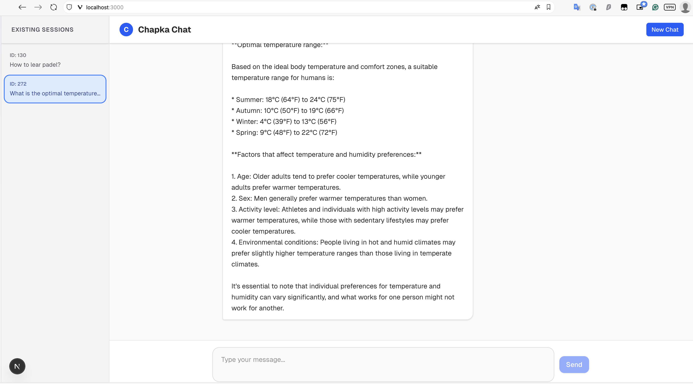

# Chapka App

It's a simple chat app that uses FastAPI and Ollama to generate responses.

## Tech Stack

- FastAPI
- Ollama
- Next.js ([just because it was the prefered way of creating a new app](https://react.dev/learn/creating-a-react-app))
- TypeScript
- Tailwind CSS
- Jest

## Usage
The application contains two parts: backend and frontend. To run the application, you need to have `docker` and `docker-compose` installed and running

In the project root directory run:
```bash
docker compose up
```

It will fetch ollama from docker hub and run it locally. It will also pull the `llama3.2:3b` (Llama 3.2 3B-Instruct) model and run the backend and frontend applications.

After that you can open the application in your browser at `http://localhost:3000`.



You can interact with the application and see the previous sessions in the sidebar. Those sessions are stored in the backend and will be lost after restart. Nevertheless, the context if the conversation is preserved while the backend is running. We can add a persistent storage for the sessions later. 


This project was implemented by myself but I used a lot of AI tools to help me with the implementation. 
Test were implemented fully by the coding agent.
